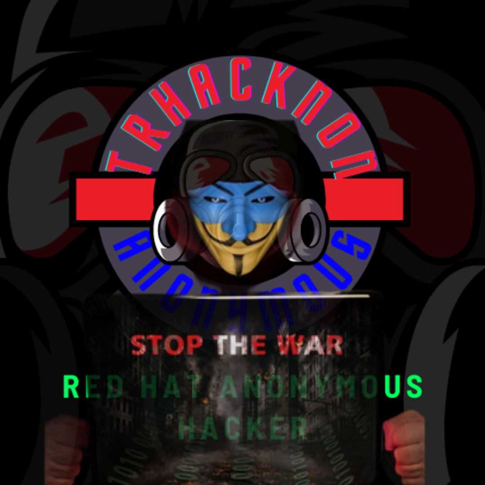

# Présentation de Trhacknon

Je suis Trhacknon, un Anonymous Rainbow Hat Hacker passionné par le développement web et la programmation, engagé dans l'hacktivisme.

## Qui suis-je ?

Je suis un individu qui croit en la liberté d'expression, la protection de la vie privée et la justice sociale. Mon objectif est d'utiliser mes compétences en programmation et en sécurité informatique pour promouvoir ces valeurs et faire entendre ma voix à travers l'hacktivisme.

## Anonymous

Anonymous est un mouvement international de hacktivistes qui se sont regroupés autour d'idéaux communs tels que la lutte contre la censure, la défense de la liberté d'expression et la dénonciation de l'injustice. Le mouvement est symbolisé par le masque de Guy Fawkes, qui représente l'anonymat et la résistance contre l'oppression.

En tant que membre d'Anonymous, je m'identifie avec les principes et les actions du collectif. J'adhère aux idéaux de transparence, de responsabilisation des institutions et de soutien aux causes justes.

## Mes compétences

- Développement web : J'ai une solide expérience dans la création d'applications web et de sites web interactifs. J'utilise des langages de programmation tels que HTML, CSS, JavaScript et PHP pour construire des interfaces conviviales et des fonctionnalités avancées.

- Sécurité informatique : Je possède des connaissances approfondies en matière de sécurité informatique, notamment en ce qui concerne la protection contre les attaques telles que les injections SQL, les cross-site scripting (XSS) et les atteintes à la vie privée en ligne. Je m'efforce de sensibiliser les utilisateurs à ces problématiques et de contribuer à la création d'un environnement en ligne plus sûr.

- Hacktivisme : Je m'engage activement dans des actions hacktivistes visant à promouvoir des causes sociales, politiques et environnementales. Je participe à des opérations de sensibilisation, à la divulgation responsable de vulnérabilités et à des projets open source visant à renforcer la sécurité et la confidentialité des utilisateurs en ligne.

## Mon objectif

Mon objectif principal est de faire une différence positive dans le monde numérique en utilisant mes compétences techniques et mon engagement envers les valeurs de l'hacktivisme. Je suis convaincu que l'information et la technologie peuvent être des outils puissants pour le changement social, et je m'efforce de les utiliser de manière responsable et éthique.

Je crois fermement en la collaboration et en l'échange de connaissances. Je suis toujours ouvert à de nouvelles idées et à de nouvelles opportunités de travail avec des individus partageant les mêmes idées. Ensemble, nous pouvons créer un internet plus libre, plus sûr et plus équitable pour tous.

## Contact

Si vous souhaitez me contacter pour discuter de collaborations, de projets ou simplement pour échanger des idées, n'hésitez pas à me contacter à l'adresse suivante : [trhacknon@example.com](mailto:trhacknon@example.com).
